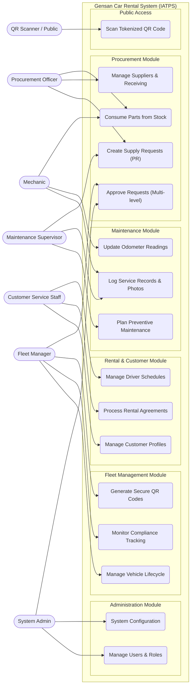

# Gensan Car Rental System (IATPS) - Use Case Diagram & Analysis

## 1. System Overview
The Integrated Asset Tracking and Procurement System (IATPS) is a comprehensive web-based platform tailored for Gensan Car Rental. It centralizes fleet tracking, rental agreements, maintenance schedules, procurement requests, and system security into a cohesive environment. 

This document defines the architectural Use Case Diagram, detailing the primary system actors and mapping their permissions to the specific system modules to provide a holistic view of user interactions.

## 2. Identified Primary Actors
The platform utilizes custom database-backed RBAC (Role-Based Access Control). Listed below are the distinct roles interacting with the system:

| Actor | Description |
| :--- | :--- |
| **System Admin** | Possesses unrestricted (`*`) access across all modules. Responsible for system configuration, user access management, and high-level overrides. |
| **Fleet Manager** | Oversees the vehicle fleet, manages compliance records, retires vehicles, and approves level-2 procurement requests. |
| **Customer Service** | Manages walk-in/corporate customers, coordinates vehicle rentals (check-out/in), and schedules driver/chauffeur assignments. |
| **Maintenance Supervisor**| Plans preventive vehicle maintenance, reviews structural damage reports, and oversees overall fleet health. |
| **Mechanic** | Executes the physical repair work. Responsible for updating odometer readings, logging service photos, and consuming part inventories. |
| **Procurement Officer** | Responsible for supply chain management. Creates purchase requests (PR), fulfills orders, logs inventory, and manages the supplier directory. |
| **QR Scanner** | A restricted/public role utilized strictly for scanning HMAC-secured QR Codes to view stateless, public-facing vehicle profiles and verification status without logging in. |

---

## 3. Use Case Map by Module

### 3.1 Fleet & Compliance Module
* **UC-FLT-01 Manage Vehicles:** Add, update, retire, and track real-time locations and statuses of fleet assets.
* **UC-FLT-02 Track Compliance:** Monitor LTO registrations, insurances, and franchises. Flag expiring compliance parameters.
* **UC-FLT-03 Generate QR Codes:** Mint secure, token-backed QR codes for physical tagging of vehicles.

### 3.2 Rentals & Operations Module
* **UC-RNT-01 Manage Customers:** Keep profiles of drivers' licenses, credit limits, blacklisted individuals, and emergency contacts.
* **UC-RNT-02 Manage Rentals:** Execute the core rental life cycle (Reservation -> Checkout -> Return -> Settlement/Cancellation).
* **UC-RNT-03 Process Damage Reports:** Log pre or post-rental damage issues, tagging responsibilities (Customer vs. Normal Wear & Tear).
* **UC-RNT-04 Driver Assignments:** Map internal corporate chauffeurs to external rental dispatches.

### 3.3 Maintenance & Mechanics Module
* **UC-MNT-01 Schedule Maintenances:** Log upcoming periodic inspections based on time or mileage limits.
* **UC-MNT-02 Execute Service Tasks:** Add diagnostic notes, labor costs, and upload forensic photos of part damage/replacements.
* **UC-MNT-03 Consumption Logging:** Deplete physical inventory stocks based on repair necessities.

### 3.4 Procurement & Inventory Module
* **UC-PRO-01 Request Parts (PR):** Trigger a formalized multi-level approval pipeline to order supplies.
* **UC-PRO-02 Authorize Purchases:** Fleet Managers/Admins grant budget authorizations before PO issuance.
* **UC-PRO-03 Supplier Directory:** Maintain data for part vendors, accreditation levels, and account balance mappings.

---

## 4. Mermaid Use Case Diagram

